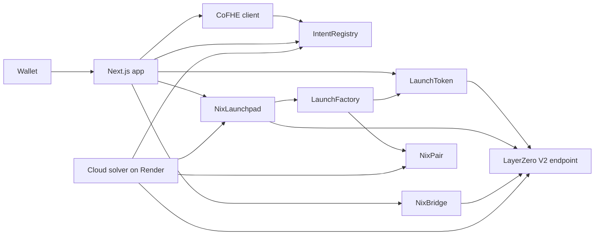

# NixSwap

NixSwap is an omnichain DeFi hub on Arbitrum Sepolia, Base Sepolia, and Ethereum Sepolia. One wallet session covers a confidential swap, a LayerZero bridge, an omnichain token launch, public liquidity, a live portfolio, and a public market board.

NIX is the quote asset. Each network has its own NIX contract. A launched token is created once and represented on all three networks. Swap size and limit stay encrypted until a whitelisted solver fills the order. Pool reserves, spot prices, token lists, and bridge escrow stay public, and every number in the app is read from those chains.

The preferred wallet network is Arbitrum Sepolia (chain id 421614).

## 1. Project overview and features

### Confidential swap and the cloud solver

A swap publishes the token route and stores the amount, the target chain, and the minimum received as ciphertext. The user approves `IntentRegistry` for the pay token, the browser encrypts the order with CoFHE, and `submitSwapIntent` stores the order. That transaction does not move balances.

The cloud solver is a Node.js process. It polls each configured chain, grants itself decrypt access with `grantSolverAccess`, decrypts the three fields, and calls `fillSwap`. `fillSwap` pulls the public tokens and calls `NixPair.swap` with the user's minimum as `minOut`. The output is paid to the user.

The order stays open when any of these is true:

- The constant-product quote is below the encrypted minimum.
- The encrypted target chain is not the chain the solver is filling.
- The pair is not listed by the current launchpad.
- The order has expired.

`MAX_WINDOW` is one hour. The app defaults the expiry to 30 minutes and refuses a window outside that hour. The approval the app sends is max `uint256`, so the trade size is not published in the approval. Confidential amounts use 6 decimals. Public token balances use the token's own decimals, 18 for NIX and for launched tokens. The registry multiplies a filled amount by `1e12` (`CONFIDENTIAL_TO_PUBLIC`) before it calls the pool.

The quote is fee-less constant product:

```text
amountOut = reserveOut * amountIn / (reserveIn + amountIn)
```

Slippage presets in the app are 0.10%, 0.50%, and 1.00%. The default is 0.50%. The minimum received is that quote minus the selected tolerance, floored to 6 confidential decimals. The wallet quotes the ETH cost of the proof and the transaction at signature time. One side of a pool route is NIX.

Only a solver already whitelisted on that chain's registry can be named in the order. The deployed solver is `0x9AFe5CeF11fC10756faef213f7A30D9873B5d372`. The registry owner can call `setSolver`. The app shows that action when the connected wallet is the owner and the configured solver is not yet allowed.

### LayerZero bridge

NixSwap has two bridge paths. They are different contracts and different balances.

**Lock and release** is `NixBridge`, for NIX and any other token the bridge has registered. `send` locks the exact amount on the source. LayerZero V2 tells the destination bridge to release the same amount from escrow. This path never mints. Accounted escrow cannot be withdrawn by the owner. A release reverts when escrow is short. The form shows the shortfall and can switch the wallet to the destination with the deposit field filled. `deposit` adds tokens to that chain's escrow book. The cloud solver can also deposit NIX it already holds on a chain whose escrow is below its target. It cannot pull escrow across chains.

NIX is registered as `NixBridge.NIX_TOKEN_ID`, which is `keccak256("NIX")`. Deployed NIX routes start at 50,000 NIX of capacity and refill over one hour, in both directions. An unset limit fails closed. Callers should read `rateLimit` rather than assume the capacity never changes. A route is refused when the on-chain peer does not match the bridge saved in `frontend/config/deployments.json`.

**Burn and mint** is `LaunchToken`, the omnichain fungible token created by the launchpad. `send` burns the amount on the source. The peer token mints the same amount on the destination. Peers are set once, during launch relay. A token appears in the burn-and-mint form when its `localEid` matches the connected network.

Both paths quote `quoteSend`. The quote is a native fee only. It does not include a delivery time, so the route card does not invent one. The wallet pays that fee plus a tenth (`fee * 11 / 10`). Unused ETH is refunded. A blank recipient means the connected wallet. Portfolio send is different: it is an ordinary ERC-20 `transfer` and requires an explicit recipient.

The shared LayerZero V2 testnet endpoint is `0x6EDCE65403992e310A62460808c4b910D972f10f`.

| Network | Chain id | Endpoint id |
| --- | --- | --- |
| Arbitrum Sepolia | 421614 | 40231 |
| Base Sepolia | 84532 | 40245 |
| Ethereum Sepolia | 11155111 | 40161 |

### Omnichain launchpad

`NixLaunchpad.createToken(name, symbol, supply)` is one transaction. It deploys a `LaunchToken` and a `NixPair` through `LaunchFactory`. The creator does not approve or spend NIX.

The supply is the shared cap, in 18-decimal units, and it is capped at 1 trillion tokens (`MAX_SUPPLY`). The name is 1 to 32 bytes. The symbol is 1 to 11 bytes. With three wired chains the split is fixed by `LIQUIDITY_BPS` (200) and `CHAIN_COUNT` (3):

- 94% is minted to the creator on the source chain.
- 2% is seeded into the source NIX pair together with 100 NIX (`SEED_NIX`) already held by that launchpad.
- Each of the other two chains later mints only its own 2% into its own pair, after relay and finalize.

A supply of `10000000` tokens is `10_000_000e18`. The creator receives 9,400,000 on the source chain. Each of the three pairs receives 200,000 tokens and 100 NIX. The three pool shares are the 6% auto-liquidity. The opening LP tokens stay on the launchpad. They are not a user deposit and cannot be withdrawn from the Pool page.

`createToken` reverts unless `chainSlots()` reports exactly three chains, so a token cannot be created with only the source pool. It also reverts when the launchpad holds less than 100 NIX (`InsufficientSeed`). `seedCapacity` reports how many opening pools the current NIX balance covers. Each current launchpad was funded for 100 seeds. One wallet has one active launch until `retire`. Retire closes the slot. The token and its pair stay in the public list.

`relay` pays LayerZero to authorize the peer launchpads. Anyone can pay that fee, including the solver. `quoteRelay` returns the native fee. `finalizeRemote` deploys the peer token and seeds that chain's pool after the message has landed and that launchpad holds 100 NIX. The cloud solver sends both steps. The number stored on every chain is the shared cap. The Launch card reads `totalSupply` for the amount minted on the connected network.

### Pool and liquidity

The market pool is `NixPair`, one pair per launched token. Opening liquidity is the launchpad's 100 NIX and that chain's 2%. A later deposit is `addLiquidity`. The pair pulls both assets at the current reserve ratio, so the amounts that land can be smaller than the amounts typed. The user approves the exact public amounts first. The Pool page refuses a deposit larger than the connected wallet's NIX or token balance.

`removeLiquidity` burns the caller's public shares and returns both assets pro rata. Those shares are only the liquidity that wallet added. They do not include the launchpad's opening position.

`quoteSwap`, `reserveNix`, `reserveToken`, `priceX18`, and `volumeWindowNix` are public. `priceX18` is `reserveNix * 1e18 / reserveToken`. The volume window is one day (`MARK_WINDOW`). There is no swap fee.

`NixPool` is a separate contract: a single-asset NIX vault with a public reserve and encrypted per-provider shares. The app does not read markets from it, and the Pool page does not call it.

### Portfolio

`/portfolio` is the account surface. It reads the connected wallet's balances for NIX, bridge-registered tokens, and launchpad tokens on each deployed network. A token such as an extra registered asset is listed only when that chain returns its address.

The priced total is denominated in NIX. Marks come from live `NixPair` prices. NIX counts at face value. A token with no spot price is listed and left out of the total. There is no USD total. A disconnected wallet says the balance is unread. A failed read says the value is unavailable.

Send transfers the selected token with ERC-20 `transfer`. Receive shows the connected address, a copy action, and a QR code. Add to wallet reads `symbol` and `decimals`, then calls `wallet_watchAsset`. History is the History tab, also available at `/portfolio?tab=history`. It walks recent logs on all three networks and keeps the newest 20 matches. An encrypted order is labeled "Encrypted amount". Older transactions stay on the block explorer.

### Real-time markets

`/markets` reads the current launchpad. Each row is a launched token and its pair. Spot price, reserves, 24-hour change, and window volume are public `NixPair` values. The 24-hour column uses the on-chain daily price mark. Volume is NIX added to the pool during the current window. A row links to `/swap?token=` and `/pool?token=`.

The launchpads deployed on 30 September 2026 report `tokenCount` 0, so this board starts empty. Older tokens such as Sample remain on previous factories and are not listed here. The app reads only the factory saved in `deployments.json`.

The navbar faucet calls `NixToken.claimFaucet`. The current source pays `FAUCET_DRIP` of 500 NIX from the owner, once per address per day, up to a budget of 100,000,000 NIX. The button label is the value returned by `FAUCET_DRIP` on the connected token. The button is hidden when that read fails.

## 2. Fhenix and CoFHE

NixSwap uses the Fhenix CoFHE stack for confidentiality. Contracts import `FHE`, `euint64`, `euint32`, `externalEuint64`, and `externalEuint32` from `@fhenixprotocol/cofhe-contracts/FHE.sol`. The browser and the solver use `@cofhe/sdk` (`0.7.1`). The web client is created with `createCofheClient` from `@cofhe/sdk/web` and is bound to the wagmi public client and wallet client. Supported CoFHE chains in the app are Ethereum Sepolia, Arbitrum Sepolia, and Base Sepolia.

CoFHE is fully homomorphic encryption operated as a network service. The user encrypts a value in the browser. The chain stores a ciphertext handle, not the integer. A contract can allow a specific address to decrypt that handle. Verification of a decrypted result happens on chain with `FHE.verifyDecryptResultSafe` before the cleartext is allowed to affect a transfer.

### What the swap encrypts

For a swap, the app encrypts three values as one batch, in this order, with the intent registry as the consuming contract:

1. Amount, `euint64`, in 6-decimal confidential units.
2. Target chain id, `euint32`.
3. Minimum received, `euint64`, in the same 6-decimal units.

`Encryptable.uint64` and `Encryptable.uint32` produce the handles and one `inputProof`. `submitSwapIntent` checks that proof and stores the handles. `FHE.allowThis` lets the registry refer to them later. The submitter, the public, and any other address are not granted decrypt access at submission.

The designated solver later calls `grantSolverAccess`. That call uses `FHE.allow` for the three handles and reverts after `expiresAt`, so a late solver never receives access. CoFHE ACL entries themselves do not expire. The registry simply refuses to grant them once the window has closed. `fillSwap` checks the solver's decryption proofs, checks that the target chain is the chain of execution, scales the 6-decimal values to 18 decimals, and performs a public ERC-20 settlement.

Token addresses, pool reserves, the solver address, and the filled amounts emitted by `SwapFilled` are public. The order size is hidden until the solver fills it. A reverted fill does not publish a successful transfer. An order left open because the quote is under the minimum is not filled, so the size stays encrypted.

### Where else FHE exists

`NixToken` can hold a confidential balance. Public tokens move into `CONFIDENTIAL_POOL` on shield and back out on a verified unshield. Confidential math uses 6 decimals because `euint64` cannot safely track 18. An insufficient confidential spend moves encrypted zero instead of reverting, so the revert cannot reveal whether the balance was large enough. The swap form does not call shield. It spends the public ERC-20 balance at fill time.

`NixPool` keeps each provider's shares as an `euint64`. The total reserve is plaintext so solvency can be checked. A withdrawal amount is encrypted. The app's Pool page does not call this contract.

`NixLaunch` is a sealed-bid sale. Bids and the clearing total are ciphertext until the window ends. The live Launch page does not call it. Creating a token goes through `NixLaunchpad`, which is a public fixed-supply deployment. The encrypted product surface in the app is the swap intent.

The Fhenix CoFHE reference for types, permits, and the client is [cofhe-docs.fhenix.zone](https://cofhe-docs.fhenix.zone/). NixSwap follows those rules: encrypt before the transaction, name the consuming contract, and grant decrypt access only to the party that must settle.

## 3. Smart-contract integration

There is no separate router contract. A confidential swap enters through `IntentRegistry`. Public settlement is `NixPair.swap`, and only the fill path calls it. Public quotes, bridges, and launches are direct calls on the contracts below.

Addresses below are the deployments the app reads. The canonical file is `frontend/config/deployments.json`. `scripts/deploy.ts` regenerates that file and `frontend/config/contracts.ts`. Do not edit `contracts.ts` by hand. `NixPair` and `LaunchToken` are created per launch and have no single address. Read them from `NixLaunchpad.allTokens`.

Some addresses coincide across chains because of deployer nonce. They are not shared contracts. Use the row for the chain you are calling. In particular, Ethereum Sepolia's `LaunchFactory` equals Base Sepolia's `NixLaunchpad`, and Ethereum's `NixBridge` equals an older Arbitrum launchpad.

### Addresses

| Contract | Arbitrum Sepolia (421614) | Base Sepolia (84532) | Ethereum Sepolia (11155111) |
| --- | --- | --- | --- |
| NixToken | `0xfE128bCc8F4D45AB9E24bF446EEa8302d1FD4CB7` | `0x3FfcBFb90DBc92994643415838d4177cf2b64b78` | `0xb0575745DDd4c43D70F9d8a890aF52bE047b408b` |
| IntentRegistry | `0x838491A2108457b7F895C70548061776F97995D7` | `0x444CC59294421CAf78cc40fb92691b3657F0cAE6` | `0xBbc7C81C07C9E75960aDAb5F6Ee94e639C24832b` |
| NixLaunchpad | `0x86798f4777A48a3aA6cd2B1bee0E5BF7C85806eb` | `0x540a746AD6b3C87666b2B1Bcd6Cc0ee5ce235d43` | `0x2De65f74667E8B38B331302f4e341834c769DCfa` |
| LaunchFactory | `0x429D2C11Ab642e24f00153b4b551E04375caE171` | `0xaCdbE5De1AFc601a01B9026233B57702150E38b8` | `0x540a746AD6b3C87666b2B1Bcd6Cc0ee5ce235d43` |
| NixBridge | `0x6B34A7ADf191a058FaaC8377716657B5d849AA95` | `0x98e4cA0060D15dddE86e123E2e8Dc7ba35A46333` | `0x1F484EbdbCB1C6e6320ab73F7A579ceb79eF6eE2` |
| NixPool | `0x1826f4165e8Bc2363aeaDfA022be927266b36b1c` | `0xDd2BfD7A8D5E29dCcBc37f69F520A74Bd9d461b1` | `0x1A85147a0b372A56A2C93515E44d99d062264c54` |
| NixLaunch | `0x9e39A7e03a34B363debcd12F3472BD3e9eb82336` | `0xb0575745DDd4c43D70F9d8a890aF52bE047b408b` | `0xfE128bCc8F4D45AB9E24bF446EEa8302d1FD4CB7` |

Explorer links for the launchpad, factory, and bridge are in the next section's tables. ABI fragments live in `frontend/config/contracts.ts`.

### Read liquidity and the market

List pairs from the launchpad, then quote the pair. `allTokens` returns the token, the pair, the shared supply, and the creator. `quoteSwap` takes the token being sold and a public 18-decimal amount.

```ts
import { createPublicClient, http, parseUnits } from "viem";
import { arbitrumSepolia } from "viem/chains";

const launchpad = "0x86798f4777A48a3aA6cd2B1bee0E5BF7C85806eb";
const nix = "0xfE128bCc8F4D45AB9E24bF446EEa8302d1FD4CB7";
const client = createPublicClient({
  chain: arbitrumSepolia,
  transport: http("https://sepolia-rollup.arbitrum.io/rpc"),
});

const listings = await client.readContract({
  address: launchpad,
  abi: nixLaunchpadAbi,
  functionName: "allTokens",
});

const pair = listings[0].pair;
const amountOut = await client.readContract({
  address: pair,
  abi: nixPairAbi,
  functionName: "quoteSwap",
  args: [nix, parseUnits("1", 18)],
});
```

Also useful on `NixPair`: `reserveNix`, `reserveToken`, `priceX18`, `totalLiquidity`, `liquidityOf`, and `volumeWindowNix`. On the launchpad: `tokenCount`, `tokenInfo`, `chainSlots`, `seedCapacity`, and `activeLaunchOf`.

`chainSlots` returns `(slots, bpsPerChain, creatorBps)`. The current pads return `(3, 200, 9400)`. viem delivers that tuple as a positional array. Read indexes `0`, `1`, and `2`.

### Submit a confidential swap

1. Confirm `isSolver(solver)` is true. The deployed solver is the deployer address above.
2. Approve `IntentRegistry` to spend the pay token. The app approves max `uint256`. An exact approval also works if it covers the public amount.
3. Encrypt amount, target chain, and limit in one CoFHE batch. The consuming contract is the registry on that chain. Amount and limit are 6-decimal integers (`parseUnits(human, 6)`). The target chain is the chain id, packed as `uint32`.
4. Call `submitSwapIntent`.

```solidity
function submitSwapIntent(
    address tokenIn,
    address tokenOut,
    IntentType intentType,          // SWAP = 0, TRADE = 2
    externalEuint64 encryptedAmount,
    externalEuint32 encryptedTargetChain,
    externalEuint64 encryptedLimit,
    bytes calldata inputProof,
    address solver,
    uint64 expiresAt
) external returns (uint256 intentId);
```

`expiresAt` must be in the future and at most `block.timestamp + MAX_WINDOW` (1 hour). The app submits `IntentType.SWAP` (`0`). Token addresses stay plaintext. The returned id can be read with `swapRoute` and `getIntent`. `getIntent` returns handles, not cleartext amounts.

Balances change only after `fillSwap`. Integrate against the receipt of the user's submit if you need to know the order was stored. Integrate against `SwapFilled` if you need the public amounts.

### How the cloud solver handles an intent

`scripts/solver-core.ts` is the shared loop. `scripts/solver.ts` is one network. `scripts/server-solver.ts` is the long-running HTTP process used on Render.

For each open intent named to this solver, the loop:

1. Ignores a route whose token is not on the current launchpad's `allTokens` list.
2. Calls `grantSolverAccess(intentId)` once.
3. Decrypts amount, limit, and target chain through `@cofhe/sdk/node`.
4. Leaves the order open if the target chain differs, the integers do not fit, or either value is zero.
5. Scales both values by `1e12` and calls `NixPair.quoteSwap`.
6. Leaves the order open if `amountOut < minimum`.
7. Calls `fillSwap` with the cleartext tuple and the three decryption signatures.

`fillSwap` closes the intent before tokens move. A later revert cannot leave a filled flag on an order that did not pay. The solver also relays launches that still need remote pools, calls `finalizeRemote` after the message lands, retries a verified bridge message the destination has not executed, and can top up NIX escrow from NIX it already holds.

The Render service builds with `npm install && npm run build` and starts with `npm start` (`node dist/scripts/server-solver.js`). `GET /` returns the text `Solver Active`. The process listens on `PORT`, or on port 10000 when `PORT` is unset, on `0.0.0.0`. A free Render web service sleeps after 15 minutes without inbound HTTP, so an external ping of `/` about every 10 minutes is required to keep filling. Rebuild and restart that service after `deployments.json` changes. It reads launchpad addresses from that file at startup.

### Bridge tokens from another program

Lock and release, after an exact approval of the bridge:

```solidity
function quoteSend(uint32 dstEid, bytes32 tokenId, uint256 amount, address recipient)
    external view returns (uint256 nativeFee);

function send(uint32 dstEid, bytes32 tokenId, uint256 amount, address recipient)
    external payable returns (bytes32 guid);

function deposit(bytes32 tokenId, uint256 amount) external returns (uint256 received);
```

`tokenId` for NIX is `keccak256("NIX")`. `dstEid` is the LayerZero endpoint id in the table above, not the EVM chain id. Read `peers(dstEid)` and require it to equal the remote bridge in `deployments.json`. Read `accounted(tokenId)` on the destination before promising a release. Read `rateLimit(tokenId, dstEid, false)` for outbound capacity.

Burn and mint, on the launched token:

```solidity
function quoteSend(uint32 dstEid, address recipient, uint256 amount)
    external view returns (uint256 nativeFee);

function send(uint32 dstEid, address recipient, uint256 amount)
    external payable returns (bytes32 guid);
```

`send` burns from the caller. The peer must already be set. Sending the quoted fee plus a tenth matches the app and leaves room for a small quote change. The contract refunds ETH above the quoted fee.

### Launch and add liquidity from another program

```solidity
function createToken(string calldata name_, string calldata symbol_, uint256 supply)
    external returns (uint256 id, address token, address pair);

function quoteRelay(uint256 id) external view returns (uint256 nativeFee);
function relay(uint256 id) external payable returns (uint256 spent);
function finalizeRemote(uint32 srcEid, uint256 srcId) external returns (address token, address pair);
function retire(uint256 id) external;
```

`supply` is the shared cap in wei. Check `chainSlots`, `seedCapacity`, and `activeLaunchOf` first. After the source transaction, `relay` is a separate payable call. Remote pools appear only after `finalizeRemote` on each peer.

Further liquidity, after approving both tokens to the pair:

```solidity
function addLiquidity(uint256 nixAmount, uint256 tokenAmount) external returns (uint256 shares);
function removeLiquidity(uint256 shares) external returns (uint256 nixOut, uint256 tokenOut);
```

The pair may pull less than requested so the reserve ratio holds. Read the receipt for the amounts that landed.

## 4. Architecture and tech stack



The app submits the user transaction. CoFHE encrypts the swap order in the browser and decrypts it only inside the solver. LayerZero carries launch authorization and both bridge payloads. The solver polls `frontend/config/deployments.json`.

| Layer | Stack |
| --- | --- |
| Interface | Next.js 16.3.6 (App Router, webpack), React 19, TypeScript, Tailwind CSS 4 |
| UI primitives | Radix dialog, dropdown, tabs, and slot, composed locally in `frontend/components/ui` with `clsx`, `tailwind-merge`, and `lucide-react`. This is the same local-component pattern shadcn/ui uses. The repo does not install the shadcn CLI. |
| Wallet | wagmi 2.19, viem 2.56, RainbowKit. Preferred chain Arbitrum Sepolia. |
| Data | TanStack Query. Reads and writes go to the three testnet RPCs. No mock balances or prices. |
| Contracts | Solidity 0.8.28, Hardhat, Cancun, OpenZeppelin 5.4, `@fhenixprotocol/cofhe-contracts` |
| Confidentiality | `@cofhe/sdk` 0.7.1. Web client in the app. Node client in the solver. |
| Messaging | LayerZero V2, testnet endpoint `0x6EDCE65403992e310A62460808c4b910D972f10f` |
| Solver | Node.js, TypeScript, ethers. `scripts/server-solver.ts` on Render. One process polls every configured chain. |

`next dev` and `next build` pass `--webpack` because Turbopack deadlocks while tracing `@cofhe/sdk`.

### Routes

| Path | Surface |
| --- | --- |
| `/` | Redirects to `/swap` and keeps the query string, including `?token=` |
| `/swap` | Confidential swap |
| `/bridge` | Lock and release for NIX, burn and mint for a launched token |
| `/portfolio` | Balances, priced NIX value, send, receive, and history |
| `/markets` | Public prices, reserves, and volume |
| `/launch` | Create a token and relay its remote pools |
| `/pool` | Add or withdraw liquidity on a launched pair |
| `/docs` | This documentation, in the navbar More menu |
| `/history` | Redirects to `/portfolio?tab=history` |
| `/send` | Redirects to `/portfolio` |
| `/trade` | Redirects to `/bridge` |

Launch and Pool are top-level navbar links. Docs is the More item.

## Quick start

Use Node.js 20 or newer. The repository has two installs: the Hardhat project at the root, and the Next.js app in `frontend/`.

### Frontend

```bash
cd frontend
npm install
npm run dev
```

Open [http://localhost:3000](http://localhost:3000). The app starts on Arbitrum Sepolia. Injected wallets connect without extra configuration. WalletConnect uses `NEXT_PUBLIC_WALLETCONNECT_PROJECT_ID` from `frontend/.env.local` when that file is present. A placeholder project id still allows an injected wallet. The dev overlay warning from a missing WalletConnect project is that configuration, not a failed contract read.

```bash
cd frontend
npm run build
npm start
```

### Solver

Create a root `.env` with the solver key. The key must already be whitelisted on each chain's intent registry. The deployed solver address is `0x9AFe5CeF11fC10756faef213f7A30D9873B5d372`.

```bash
PRIVATE_KEY=
SOLVER_CHAINS=all
```

`SOLVER_CHAINS` defaults to Arbitrum Sepolia and Base Sepolia. `all` adds Ethereum Sepolia. `SOLVER_POLL_MS` defaults to 20000 and must be at least 1000.

Run one pass against a single network:

```bash
npm install
npm run solve -- --network "Arbitrum Sepolia"
```

Run the polling service:

```bash
npm install
npm run build
npm start
```

Optional RPC overrides are `ARBITRUM_SEPOLIA_RPC_URL`, `BASE_SEPOLIA_RPC_URL`, and `SEPOLIA_RPC_URL`.

### Contracts

```bash
npm install
npm test
```

Replacing a launchpad spends the deployer key and points the app at the new factory. Deploy every chain before wiring. The first peer on a route is permanent.

```bash
REPLACE_LAUNCHPAD=1 npm run deploy -- --network "Arbitrum Sepolia"
REPLACE_LAUNCHPAD=1 npm run deploy -- --network "Base Sepolia"
REPLACE_LAUNCHPAD=1 npm run deploy -- --network "Ethereum Sepolia"
WIRE_PEERS=1 npm run deploy -- --network "Arbitrum Sepolia"
WIRE_PEERS=1 npm run deploy -- --network "Base Sepolia"
WIRE_PEERS=1 npm run deploy -- --network "Ethereum Sepolia"
```

`npm run deploy:bridge -- --network "<name>"` registers NIX on the bridge and sets a peer only when it is still unset. It does not move NIX into escrow.

## Live launchpad, factory, and bridge

Each launchpad reports three chain slots, holds 10,000 NIX for 100 opening pools, and has both remote peers set.

| Network | Launchpad | Factory | Bridge |
| --- | --- | --- | --- |
| Arbitrum Sepolia | [`0x86798f4777A48a3aA6cd2B1bee0E5BF7C85806eb`](https://sepolia.arbiscan.io/address/0x86798f4777A48a3aA6cd2B1bee0E5BF7C85806eb) | [`0x429D2C11Ab642e24f00153b4b551E04375caE171`](https://sepolia.arbiscan.io/address/0x429D2C11Ab642e24f00153b4b551E04375caE171) | [`0x6B34A7ADf191a058FaaC8377716657B5d849AA95`](https://sepolia.arbiscan.io/address/0x6B34A7ADf191a058FaaC8377716657B5d849AA95) |
| Base Sepolia | [`0x540a746AD6b3C87666b2B1Bcd6Cc0ee5ce235d43`](https://sepolia.basescan.org/address/0x540a746AD6b3C87666b2B1Bcd6Cc0ee5ce235d43) | [`0xaCdbE5De1AFc601a01B9026233B57702150E38b8`](https://sepolia.basescan.org/address/0xaCdbE5De1AFc601a01B9026233B57702150E38b8) | [`0x98e4cA0060D15dddE86e123E2e8Dc7ba35A46333`](https://sepolia.basescan.org/address/0x98e4cA0060D15dddE86e123E2e8Dc7ba35A46333) |
| Ethereum Sepolia | [`0x2De65f74667E8B38B331302f4e341834c769DCfa`](https://sepolia.etherscan.io/address/0x2De65f74667E8B38B331302f4e341834c769DCfa) | [`0x540a746AD6b3C87666b2B1Bcd6Cc0ee5ce235d43`](https://sepolia.etherscan.io/address/0x540a746AD6b3C87666b2B1Bcd6Cc0ee5ce235d43) | [`0x1F484EbdbCB1C6e6320ab73F7A579ceb79eF6eE2`](https://sepolia.etherscan.io/address/0x1F484EbdbCB1C6e6320ab73F7A579ceb79eF6eE2) |

## Security

These contracts are on public testnets. Treat the assets as test assets. The repository does not publish a third-party audit or a bug bounty. The user's key stays in the wallet. Only a whitelisted solver can fill an order. A fill reverts when the pool cannot pay the minimum. Lock-and-release pays from escrow. A bridge route is refused when the on-chain peer does not match the deployed bridge. Launch supply is capped, and a remote finalize checks that the minted amount is that chain's pool share.

## License

ISC.

## About the Builder

**Built by:** JUBAYIR69

JUBAYIR69 is a Web3 developer focused on high-performance, secure, and user-centric DeFi applications.

- **Discord:** [discordapp.com/users/1209377505442537484](https://discordapp.com/users/1209377505442537484)
- **Twitter:** [@alr80171](https://x.com/alr80171)
- **Personal website:** [jubayir-69.vercel.app](https://jubayir-69.vercel.app/)
- **NixSwap Twitter:** [@NixSwap](https://x.com/NixSwap)
