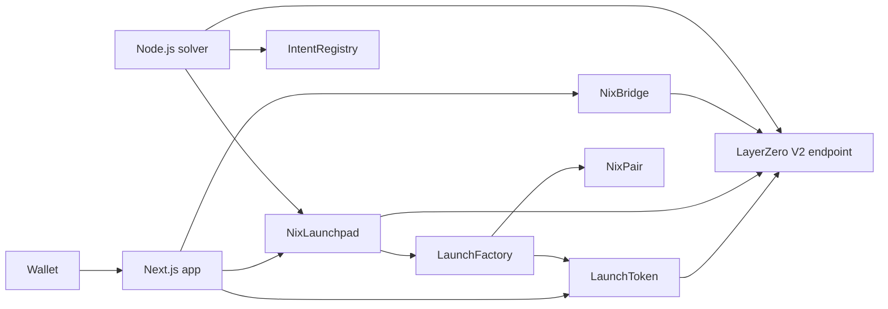

# NixSwap

NixSwap is a production-grade omnichain DeFi hub. One wallet session covers markets, confidential swaps, pooled liquidity, token launch, bridging, and a live portfolio across Arbitrum Sepolia, Base Sepolia, and Ethereum Sepolia.

A new token is one signature. The source chain keeps 94% with the creator and opens a NIX pool with 2%. The other two chains each receive 2%, so 6% of supply backs liquidity from the start. Launched tokens move by burning on the source and minting on the destination. NIX itself moves by lock and release. Swap size and limit stay encrypted. Pool reserves, spot prices, and the token list stay public.

## Key features

### Omnichain token launchpad

`NixLaunchpad.createToken` deploys a fixed-supply token and a NIX pair in one transaction. The creator does not approve or spend NIX. Each chain pairs its 2% with 100 NIX already held by that chain's launchpad, and the opening LP stays on the launchpad.

`relay` pays LayerZero to authorize the other two launchpads. `finalizeRemote` deploys the peer token and seeds that pool. The cloud solver sends both. Anyone can pay the relay fee. A launch reverts unless both remote peers are already wired, so a token cannot be created with only the source pool. One wallet has one active launch until `retire`. Supply per launch is capped at 1 trillion tokens.

### LayerZero OFT bridge

Newly launched tokens are omnichain fungible tokens. `LaunchToken.send` burns the amount on the source chain. The peer token mints the same amount on the destination. Peers are set once.

NIX, and any other token registered on `NixBridge`, uses lock and release. The bridge escrows tokens and never mints them. A release happens only when the LayerZero endpoint delivers a message from a registered peer.

### Confidential swapping

A swap publishes the token route and stores the amount, target chain, and minimum received as ciphertext. The whitelisted solver decrypts the order, fills it against the public constant-product pool, and leaves the order open when the quote is below the limit or the target chain does not match. Orders expire within one hour.

### Unified portfolio

Portfolio reads the connected wallet's on-chain balances for NIX, bridge-registered tokens, and launched tokens on each deployed network. Send transfers the selected token. Receive shows the connected address, a copy action, and a QR code. Add to wallet reads the token's symbol and decimals, then calls `wallet_watchAsset`.

Markets, Pool, and Launch use the same live contracts. A disconnected wallet shows that the balance is unread. A failed read shows that the value is unavailable.

## Architecture



The app submits the user transaction. LayerZero carries the launch authorization and the token bridge payload. The solver polls `frontend/config/deployments.json`, fills open swap intents, relays a launch that still needs its remote pools, finalizes a remote pool after the message lands, and retries a verified bridge message the destination has not executed.

| Layer | Stack |
| --- | --- |
| Interface | Next.js 16, React 19, TypeScript, Tailwind CSS 4, wagmi, viem, RainbowKit |
| Contracts | Solidity 0.8.28, Hardhat, Cancun, OpenZeppelin 5.4 |
| Confidentiality | CoFHE encrypted inputs for swap amount, target chain, and limit |
| Messaging | LayerZero V2, testnet endpoint `0x6EDCE65403992e310A62460808c4b910D972f10f` |
| Solver | Node.js, TypeScript, ethers. One process polls every configured chain |

| Network | Chain id | LayerZero endpoint id |
| --- | --- | --- |
| Arbitrum Sepolia | 421614 | 40231 |
| Base Sepolia | 84532 | 40245 |
| Ethereum Sepolia | 11155111 | 40161 |

The preferred wallet network is Arbitrum Sepolia.

## Live contracts

These are the contracts the app reads. Each launchpad reports three chain slots, holds 10,000 NIX for 100 opening pools, and has both remote peers set.

| Network | Launchpad | Factory | Bridge |
| --- | --- | --- | --- |
| Arbitrum Sepolia | [`0x86798f4777A48a3aA6cd2B1bee0E5BF7C85806eb`](https://sepolia.arbiscan.io/address/0x86798f4777A48a3aA6cd2B1bee0E5BF7C85806eb) | [`0x429D2C11Ab642e24f00153b4b551E04375caE171`](https://sepolia.arbiscan.io/address/0x429D2C11Ab642e24f00153b4b551E04375caE171) | [`0x6B34A7ADf191a058FaaC8377716657B5d849AA95`](https://sepolia.arbiscan.io/address/0x6B34A7ADf191a058FaaC8377716657B5d849AA95) |
| Base Sepolia | [`0x540a746AD6b3C87666b2B1Bcd6Cc0ee5ce235d43`](https://sepolia.basescan.org/address/0x540a746AD6b3C87666b2B1Bcd6Cc0ee5ce235d43) | [`0xaCdbE5De1AFc601a01B9026233B57702150E38b8`](https://sepolia.basescan.org/address/0xaCdbE5De1AFc601a01B9026233B57702150E38b8) | [`0x98e4cA0060D15dddE86e123E2e8Dc7ba35A46333`](https://sepolia.basescan.org/address/0x98e4cA0060D15dddE86e123E2e8Dc7ba35A46333) |
| Ethereum Sepolia | [`0x2De65f74667E8B38B331302f4e341834c769DCfa`](https://sepolia.etherscan.io/address/0x2De65f74667E8B38B331302f4e341834c769DCfa) | [`0x540a746AD6b3C87666b2B1Bcd6Cc0ee5ce235d43`](https://sepolia.etherscan.io/address/0x540a746AD6b3C87666b2B1Bcd6Cc0ee5ce235d43) | [`0x1F484EbdbCB1C6e6320ab73F7A579ceb79eF6eE2`](https://sepolia.etherscan.io/address/0x1F484EbdbCB1C6e6320ab73F7A579ceb79eF6eE2) |

NIX and the swap registry on the same deployments:

| Network | NIX | Intent registry |
| --- | --- | --- |
| Arbitrum Sepolia | `0xfE128bCc8F4D45AB9E24bF446EEa8302d1FD4CB7` | `0x838491A2108457b7F895C70548061776F97995D7` |
| Base Sepolia | `0x3FfcBFb90DBc92994643415838d4177cf2b64b78` | `0x444CC59294421CAf78cc40fb92691b3657F0cAE6` |
| Ethereum Sepolia | `0xb0575745DDd4c43D70F9d8a890aF52bE047b408b` | `0xBbc7C81C07C9E75960aDAb5F6Ee94e639C24832b` |

`NixPair` and `LaunchToken` are created per launch and have no single address. The canonical list is `frontend/config/deployments.json`, which `scripts/deploy.ts` regenerates. Do not edit `frontend/config/contracts.ts` by hand.

## Quick start

Use Node.js 20 or newer. The repository has two installs: the Hardhat project at the root, and the Next.js app in `frontend/`.

### Frontend

```bash
cd frontend
npm install
npm run dev
```

Open [http://localhost:3000](http://localhost:3000). The app starts on Arbitrum Sepolia. Injected wallets connect without extra configuration. WalletConnect uses `NEXT_PUBLIC_WALLETCONNECT_PROJECT_ID` from `frontend/.env.local` when that file is present.

```bash
cd frontend
npm run build
npm start
```

### Solver

Create a root `.env` with the solver key. The key must already be whitelisted on each chain's intent registry. The deployed solver address is `0x9AFe5CeF11fC10756faef213f7A30D9873B5d372`.

```bash
PRIVATE_KEY=
SOLVER_CHAINS=all
```

`SOLVER_CHAINS` defaults to Arbitrum Sepolia and Base Sepolia. `all` adds Ethereum Sepolia. `SOLVER_POLL_MS` defaults to 20000 and must be at least 1000.

Run one pass against a single network:

```bash
npm install
npm run solve -- --network "Arbitrum Sepolia"
```

Run the polling service. `GET /` returns `Solver Active`. The process listens on `PORT`, or on port 10000 when `PORT` is unset.

```bash
npm install
npm run build
npm start
```

Optional RPC overrides are `ARBITRUM_SEPOLIA_RPC_URL`, `BASE_SEPOLIA_RPC_URL`, and `SEPOLIA_RPC_URL`.

### Contracts

```bash
npm install
npm test
```

Replacing a launchpad spends the deployer key and points the app at the new factory:

```bash
REPLACE_LAUNCHPAD=1 npm run deploy -- --network "Arbitrum Sepolia"
REPLACE_LAUNCHPAD=1 npm run deploy -- --network "Base Sepolia"
REPLACE_LAUNCHPAD=1 npm run deploy -- --network "Ethereum Sepolia"
WIRE_PEERS=1 npm run deploy -- --network "Arbitrum Sepolia"
WIRE_PEERS=1 npm run deploy -- --network "Base Sepolia"
WIRE_PEERS=1 npm run deploy -- --network "Ethereum Sepolia"
```

Deploy every chain before wiring. The first peer on a route is permanent.

## Routes

| Path | Surface |
| --- | --- |
| `/` | Confidential swap |
| `/markets` | Public prices, reserves, and volume |
| `/pool` | Add liquidity to a launched pair |
| `/launch` | Create a token and relay its remote pools |
| `/bridge` | Lock and release for NIX, burn and mint for a launched token |
| `/portfolio` | Live balances, send, receive, and add to wallet |
| `/send` | Redirects to `/portfolio` |

## License

ISC.

## About the Builder

**Built by:** JUBAYIR69

- **Discord:** [discordapp.com/users/1209377505442537484](https://discordapp.com/users/1209377505442537484)
- **Twitter:** [@alr80171](https://x.com/alr80171)
- **Personal Website:** [jubayir-69.vercel.app](https://jubayir-69.vercel.app/)
